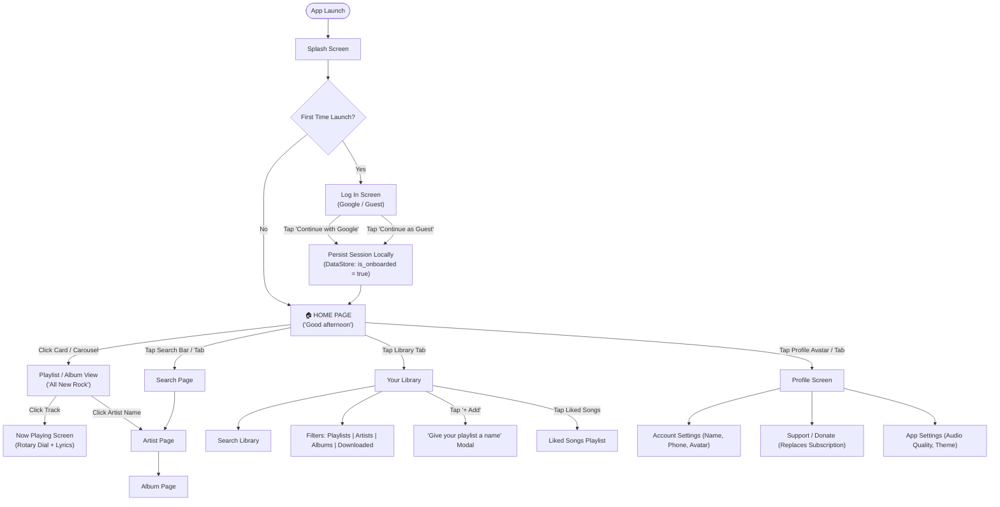

# 🎵 OCTOBER — Complete Front-End Design System & Architecture Specification
> **SINGLE SOURCE OF TRUTH (SSOT)**  
> This document specifies every design token, color hex code, typography rule, layout metric, icon definition, user flow, and screen wireframe for the **October** music application. Refer to this file for all front-end UI/UX implementations.

---

## 1. App Identity & Environment
* **App Name**: October
* **Package / Application ID**: `com.october.music` (Debug: `com.october.music.debug`)
* **Repository**: `https://github.com/szzsuke/October`
* **Target Framework**: Android (Jetpack Compose, Kotlin, Material3, ExoPlayer/Media3)
* **Coexistence**: Fully isolated package identity; installs side-by-side with original Metrolist without collisions.

---

## 2. Color System (Monochrome Palette)

All colors are strictly derived from the approved monochrome palette:

| Token Name | Hex Code | RGB | Role & Usage Mapping |
|:---|:---:|:---:|:---|
| `ColorBackground` | **`#151515`** | `21, 21, 21` | **App Canvas / Deep Background** — Main screen background across all views in Dark Mode. |
| `ColorSurface` | **`#313132`** | `49, 49, 50` | **Card & Surface Background** — Elevated card containers, search bar, floating bottom tab bar, filter chips, settings groups. |
| `ColorOutline` | **`#636363`** | `99, 99, 99` | **Borders & Inactive Bars** — Outlines, subtle separators, unplayed soundwave bars, unselected toggle borders. |
| `ColorTextSecondary`| **`#808080`** | `128, 128, 128`| **Secondary Information** — Subtitles, artist names, duration timestamps (`0:00`, `3:00`), inactive icons, placeholder text. |
| `ColorTextVariant` | **`#E7E7E7`** | `231, 231, 231`| **Primary Icons & Active Pills** — Active filter text, primary icon strokes, secondary headers, section subheadings. |
| `ColorTextPrimary` | **`#FFFFFF`** | `255, 255, 255`| **High-Contrast Text & Accents** — Page titles (*"Good afternoon"*, *"Kingslayer"*), active play button, primary CTA labels. |
| `ColorToggleActive` | **`#AF52DE`** | `175, 82, 222` | **Active Toggle Track (Vibrant Purple)** — Illuminated toggle switches in Settings (*"Allow explicit content"*, *"High sound quality"*, *"Automix"*). |
| `ColorDestructive` | **`#FF3B30`** | `255, 59, 48` | **Destructive Action** — Destructive alert actions (e.g., *"Clear"* in cache purge dialog). |
| `ColorDialogSurface`| **`#2C2C2E`** | `44, 44, 46` | **Modal Alert Surface** — Elevated system confirmation dialogs (*"Clear all cache?"*). |

---

## 3. Typography: SF Pro Display

The entire application exclusively uses **SF Pro Display** with four standardized weights:

```
Family: SF Pro Display
Weights: Regular (400), Medium (500), Semibold (600), Bold (700)
```

### Hierarchy & Style Guide
1. **Display / Large Titles (Bold - 700)**:
   * Size: `28sp` – `32sp` | Line Height: `36sp`
   * Usage: *"Good afternoon"*, *"Dive Into the world of music"*, *"Your library"*, Hero Album Titles.
2. **Section Headings / Card Titles (Semibold - 600)**:
   * Size: `18sp` – `20sp` | Line Height: `24sp`
   * Usage: *"Fresh new music"*, *"Today's biggest hits"*, *"Kingslayer"*, *"All New Rock"*.
3. **Subheadings / Navigation Labels (Medium - 500)**:
   * Size: `14sp` – `16sp` | Line Height: `20sp`
   * Usage: Filter chips (*"Playlists"*, *"Artists"*), Button labels (*"Continue with Google"*, *"Swipe to get started"*), Tab bar items.
4. **Body & Metadata (Regular - 400)**:
   * Size: `12sp` – `14sp` | Line Height: `18sp`
   * Usage: Artist names, timestamps (`0:00` / `3:00`), description paragraphs, form hints, lyrics body.

---

## 4. Grid, Layout & Dimensional Metrics

Derived directly from the master layout sheet:

```
┌────────────────────────────────────────────────────────┐
│  STATUS BAR INSET: 53dp                                │
├────────────────────────────────────────────────────────┤
│ ◄ 16dp ►                                      ◄ 16dp ► │
│                                                        │
│               MAIN CONTENT SAFE ZONE                   │
│         (Fluid scrollable body between insets)         │
│                                                        │
├────────────────────────────────────────────────────────┤
│  APPLE-STYLE FLOATING MINI-PLAYER: 56dp height         │
│  (Frosted glass capsule, 8dp gap above Dock)           │
├────────────────────────────────────────────────────────┤
│  APPLE-STYLE FLOATING DOCK (SPLIT ISLAND): 64dp height │
│  ╭───────────────────────────╮ ╭────────╮              │
│  │ 🏠 Home  ▦ New  📻  📚 Lib │ │ 🔍     │              │
│  ╰───────────────────────────╯ ╰────────╯              │
├────────────────────────────────────────────────────────┤
│  HOME INDICATOR INSET: 34dp bottom margin              │
└────────────────────────────────────────────────────────┘
```

* **Top Status Bar Inset**: `53dp` (accounts for Dynamic Island / status bar notch).
* **Horizontal Danger Zone (Side Margins)**: `16dp` left and right screen gutters.
* **Apple-Style Floating Mini-Player**:
  * Height: `56dp`, Corner Radius: `28dp` (continuous super-ellipse capsule).
  * Frosted glass material (`RenderEffect` blur `25dp` + specular highlight hairline border).
  * Stacking clearance: Floats `8dp` above Floating Dock (`106dp` from bottom edge when dock is visible; `34dp` when dock is hidden).
  * Horizontal margins: `16dp` left/right.
* **Apple-Style Floating Dock (Split Island Architecture)**:
  * Total Height: `64dp`, floating `34dp` above screen bottom.
  * **Primary Navigation Capsule** (Left):
    * Width: `weight(1f)` (fills width minus search bubble and gap).
    * Corner Radius: `32dp` pill.
    * Tabs: `Home` (`Home.svg`), `Browse / New` (`4-squares grid`), `Radio` (`Solar Transmission / Radio waves`), `Library` (`Music Library`).
  * **Circular Search Bubble** (Right):
    * Diameter: `56dp` circle, resting with `8dp` gap to the right of the main capsule.
    * Icon: Solar Magnifier `🔍` (`22dp`).
  * Material: Frosted translucent liquid glass (`rgba(255,255,255,0.82)` light / `rgba(28,28,30,0.82)` dark) with top specular border highlight.
* **Standard Component Radii**:
  * Action Buttons & Filter Pills: `24dp` (fully rounded capsules)
  * Album Art Hero: `20dp` rounded corners
  * Card Items: `16dp` rounded corners
  * Circular Elements (Play button, Avatars, Search Bubble): `50%` (circular shape)

---

## 5. Icon System (Solar Icons — Linear & Bold)

All icons are sourced exclusively from the **Solar Icon Set** by 480 Design:

### Player & Media Controls
* **Collapse Player (`⌵`)**: `Solar Icons / Linear / Arrows / Alt Arrow Down.svg`
* **Dislike (`💔`)**: `Solar Icons / Linear / Like / Heart Broken.svg`
* **Previous Track (`|◁`)**: `Solar Icons / Linear / Video, Audio, Sound / Skip Previous.svg`
* **Play Button (`▶`)**: `Solar Icons / Bold / Video, Audio, Sound / Play Circle.svg` (Solid black circle `#151515` with white triangle)
* **Pause Button (`❚❚`)**: `Solar Icons / Bold / Video, Audio, Sound / Pause Circle.svg`
* **Next Track (`▷|`)**: `Solar Icons / Linear / Video, Audio, Sound / Skip Next.svg`
* **Like / Favorite (`♡`)**: `Solar Icons / Linear / Like / Heart.svg`
* **Liked Active (`❤️`)**: `Solar Icons / Bold / Like / Heart.svg` (Filled white)
* **Repeat / Loop (`↻`)**: `Solar Icons / Linear / Video, Audio, Sound / Repeat.svg`
* **Shuffle (`🔀`)**: `Solar Icons / Linear / Video, Audio, Sound / Shuffle.svg`
* **Sleep Timer (`⏱`)**: `Solar Icons / Linear / Time / Stopwatch.svg`
* **Settings Gear (`⚙`)**: `Solar Icons / Linear / Settings, Fine Tuning / Settings Minimalistic.svg` (Smooth 6-petal flower gear)
* **Lyrics / Subtitles (`≡A`)**: `Solar Icons / Linear / List / Sort By Alphabet.svg` (3 horizontal lines with capital letter `A`)
* **Waveform Scrubber**: `Solar Icons / Linear / Video, Audio, Sound / Soundwave.svg`

### Navigation & App Utility
* **Tab 1 — Home**: `Solar Icons / Linear / Home, Furniture / Home.svg`
* **Tab 2 — Search**: `Solar Icons / Linear / Search / Magnifer.svg`
* **Tab 3 — Library**: `Solar Icons / Linear / Video, Audio, Sound / Music Library.svg`
* **Tab 4 — Profile**: `Solar Icons / Linear / Users / User.svg`
* **Notifications Bell**: `Solar Icons / Linear / Notifications / Bell.svg`
* **Three Dots Menu (`•••`)**: `Solar Icons / Linear / Essentional, UI / Menu Dots.svg`
* **Close (`✕`)**: `Solar Icons / Linear / Essentional, UI / Close Circle.svg`
* **Back (`<`)**: `Solar Icons / Linear / Arrows / Alt Arrow Left.svg`
* **Check (`✓`)**: `Solar Icons / Linear / Essentional, UI / Check Circle.svg`
* **Chevron Right (`>`)**: `Solar Icons / Linear / Arrows / Alt Arrow Right.svg`

---

## 6. User Flow Architecture



### Authentication Rules
1. **Never Re-Prompt**: Once the user taps *Continue with Google* or *Continue as Guest*, `is_onboarded` is permanently saved in DataStore. The login screen is never shown again on subsequent launches.
2. **No Paywalls**: All subscription and payment flows from upstream are replaced with a voluntary **Support / Donate** page.

---

## 7. Screen-by-Screen UI Specifications

### Screen 1: Welcome & Onboarding ("Dive Into the world of music")
* **Background**: Deep Obsidian `#151515`
* **Hero Logo**: Centered squircle October logo (96dp) with ambient purple glow (`#AF52DE`)
* **Hero Title**: `"Dive Into the world of music"` (`SF Pro Display Bold`, 28sp, `#FFFFFF`)
* **Subtitle**: `"Stream millions of songs with zero ads, high fidelity audio, and elevated aesthetics."` (`#808080`, 14sp)
* **Primary Auth Button**:
  * **"Continue with Google"**: Crisp white capsule button (`#FFFFFF` background, `#151515` bold text, 52dp height, 26dp radius) to connect Google / YouTube Music library.
* **Guest Access Button**:
  * **"Continue as Guest"**: Dark card (`#313132` surface, subtle border, 52dp height, 26dp radius) for instant local and offline access without signing in.
* **Divider**: Minimal line with centered `"or"` (`#636363`)
* **Interactive Welcome Slider**:
  * `"Swipe to get started"` pill slider with circular `>>` draggable handle to instantly enter the app with haptic feedback.

---

### Screen 3: Home Page ("Good afternoon")
* **Header Bar**:
  * Left: Greeting `"Good afternoon"` (`SF Pro Display Bold`, 24sp, `#FFFFFF` in dark mode, `#151515` in light mode)
  * Right: Notification Bell icon + Circular User Avatar (36dp)
* **Search Bar**:
  * Pill container (height 44dp, radius 22dp, `#313132` in dark mode, `#F4F4F4` in light mode)
  * Magnifier icon (`#808080`) + Placeholder text `"Search"` (`#808080`)
* **Section 1 — "Fresh new music"**:
  * Title: `"Fresh new music"` (`SF Pro Display Semibold`, 18sp)
  * Horizontal scrolling cards:
    * Wide hero cards with rounded corners (20dp).
    * Photo background with gradient bottom overlay.
    * Title (*"All New Rock"* in bold white) + Track count (*"24 songs"* in regular gray).
    * **Mini Play Button**: Frosted dark circular play button with white triangle on bottom-right of each card.
* **Section 2 — "Today's biggest hits"**:
  * Title: `"Today's biggest hits"` (`SF Pro Display Semibold`, 18sp)
  * Horizontal cards: Square artwork thumbnail + Title (*"Lovin On Me"*, *"Beautiful Things"*, *"Greedy"*) + Artist name directly below.
* **Section 3 — "Suggested artists"**:
  * Title: `"Suggested artists"` (`SF Pro Display Semibold`, 18sp)
  * Circular artist avatars (90dp diameter) with centered name below.
* **Bottom Navigation**: Floating Tab Bar (64dp height, floating 34dp from bottom).

---

### Screen 4: Notifications Bottom Sheet
* **Trigger**: Tapping the Bell icon on the Home Page.
* **Container**: Rounded bottom sheet with drag handle pill.
* **Title**: `"Notifications"` (`SF Pro Display Bold`, 18sp, centered).
* **Notification Items**:
  * Item 1: Thumbnail + Title `"Yungblud has released a new song"` + Subtitle `"2 days ago"` + **Unread Indicator** (Green dot `#28A745` on right).
  * Item 2: Thumbnail + Title `"Explore Laha's board 'Anime'"` + Subtitle `"7 days ago"`.
  * Item 3: Thumbnail + Title `"New Music Friday"` + Subtitle `"9 days ago"`.

---

### Screen 5: Search & Apple Music "Browse Categories" Grid
* **Visual Principle**: Direct implementation of Apple Music's Search experience: a sleek search field on top, and an immersive 2-column grid of rich, colorful genre/category cards with artist/album imagery beneath it when the search field is idle.
* **Top Search Bar**:
  * Pill container: `44dp` height, `22dp` corner radius, `#313132` in dark mode (`#F4F4F4` in light mode), `16dp` horizontal margins.
  * Left: Solar Linear Magnifier icon (`20dp`).
  * Placeholder: `"Search"` in `SF Pro Display Regular` (`15sp`, `#808080`).
  * Right: `"Cancel"` button appears when typing; `✕` clear icon clears active query.

#### 1. Default Idle State: "Browse Categories" Grid
* **Section Header**: `"Browse Categories"` in **`SF Pro Display Bold`** (`22sp`, `#FFFFFF` in dark mode / `#151515` in light mode, `16dp` horizontal padding, `16dp` top margin, `12dp` bottom margin).
* **2-Column Grid (Android Ergonomic Layout)**:
  * Container: `LazyVerticalGrid(columns = GridCells.Fixed(2))` with `12dp` horizontal and vertical spacing, `16dp` side gutters.
  * Card Dimensions: `100dp` fixed height, fluid column width (`fillMaxWidth()`).
  * Shape: `14dp` rounded corners (`RoundedCornerShape(14.dp)`).
  * **Visual Styling & Saturated Palettes**:
    * Each card features a rich duotone background color paired with an iconic artist portrait or album artwork seamlessly blended into the right/center portion of the card:
      - **Charts**: Mustard Olive (`#84CC16` / `#A3A227`) + charts artist imagery
      - **Hits**: Warm Saffron Gold (`#EAB308` / `#D97706`) + featured artist duo
      - **Pop**: Vibrant Bubblegum Pink (`#EC4899` / `#DB2777`) + pop star portrait
      - **Hip-Hop**: Cool Indigo Slate (`#6366F1` / `#4F46E5`) + hip-hop artist
      - **Country**: Terracotta Amber (`#F97316` / `#EA580C`) + country singer with hat
      - **Dance**: Emerald Mint (`#10B981` / `#059669`) + EDM producer
      - **Rock**: Fiery Crimson Coral (`#EF4444` / `#DC2626`) + rock band duo
      - **Latin**: Hot Magenta / Fuchsia (`#D946EF` / `#C026D3`) + latin artists
      - **R&B**: Velvet Violet (`#8B5CF6` / `#7C3AED`) + R&B vocalist
      - **Music Videos**: Royal Cobalt (`#3B82F6` / `#2563EB`) + video frame
      - **Chill / Acoustic**: Warm Mellow Taupe (`#78716C` / `#57534E`) + acoustic guitar
      - **Workout**: Electric Neon Orange (`#FF5722` / `#F97316`) + fitness music icon
    * **Vignette Gradient**: Soft dark radial/linear gradient from bottom-left (`rgba(0,0,0,0.55)` to `transparent`) ensuring maximum legibility for the label.
    * **Category Title**: Anchored at the bottom-left (`12dp` padding start and bottom), **`SF Pro Display Bold`** (`17sp`, pure white `#FFFFFF` text).
    * **Interaction**: Tapping opens the curated category playlist/hub (`youtube_browse/{browseId}?params={params}`).

#### 2. Active Typing State: Live Search Results
* **Filter Pills Row**:
  * Horizontal chips: `"Top"`, `"Songs"`, `"Artists"`, `"Playlists"`, `"Albums"`.
  * Active state: High-contrast filled pill with white text.
* **Search Results List**:
  * Artist row: Circular artist photo (48dp) + Name (*"Alex Terrible"*) + Role (*"Artist"*) + Right chevron `>`.
  * Track rows: Square thumbnail + Song name + Artist + Duration + Three-dots menu `•••`.

---

### Screen 6: Playlist & Album Detail View ("All New Rock")
* **Top Bar**: Back chevron (`<`) on left, three-dots menu (`•••`) on right.
* **Hero Section (Two Supported Variants)**:
  1. **Square Cover Art Hero**: Centered artwork (220dp × 220dp, 20dp radius).
  2. **Immersive Band Photo Header**: Full-width band photography covering top half of screen, fading seamlessly into the background color (`#151515`) via vertical gradient.
* **Metadata**:
  * Title: `"All New Rock"` (`SF Pro Display Bold`, 24sp, centered).
  * Subtitle: `"The best new rock tracks every week"` (`#808080`, 13sp, centered).
* **Action Cluster (3 Buttons in Row)**:
  1. **Download**: Circular container (`#313132`, 48dp) with download arrow + label `"Download"`.
  2. **Prominent Play**: Large circular white button (64dp diameter) with solid black play triangle + label `"Play"`.
  3. **Like**: Circular container (`#313132`, 48dp) with heart icon + label `"Like"`.
* **Track List**:
  * Row 1: Artwork + `"Dark Matter"` + `"Pearl Jam"` + `•••`
  * Row 2: Artwork + `"Explode!"` + `"Mother Mother"` + `•••`
  * Row 3: Artwork + `"Addicted"` + `"Loveless"` + `•••`
  * Row 4: Artwork + `"Cross Your Fingers"` + `"The Black Crowes"` + `•••`
  * Row 5: Artwork + `"Don't Come Running Back"` + `"PIT"` + `•••`

---

### Screen 7: "Add to Playlist" Bottom Sheet
* **Trigger**: Tapping `•••` on any track and selecting "Add to playlist".
* **Container**: Rounded bottom sheet with drag handle pill.
* **Title**: `"Add to playlist"` (`SF Pro Display Bold`, 18sp, centered).
* **Playlist Item Row**:
  * Music note icon in rounded square container (44dp) + Name (`"My playlist #1"`) + Subtitle (`"Empty"` or track count).
* **Create New Row**:
  * Rounded square container with `+` icon + Label `"Create new playlist"` (`SF Pro Display Bold`, 16sp).

---

### Screen 8: "Create New Playlist" Screen / Modal
* **Top Bar**: Close button (`✕`) on left + Header title `"Create new playlist"` (centered).
* **Prompt**: `"Give your playlist a name"` (`#808080`, 14sp, centered).
* **Input Field**: Centered underline text input with placeholder or default text `"My playlist #2"` (`SF Pro Display Bold`, 20sp).
* **Action Button**: Primary pill button `"Create"` (`#FFFFFF` background, `#151515` text, 50dp height, 25dp radius).

---

### Screen 9: Your Library (Masonry Staggered Grid Layout)
* **Visual Structure**: Dynamic 2-column masonry / staggered grid displaying playlists and albums with variable-height artwork cards.

#### 1. Header & Controls
* **Header Bar**:
  * Top status bar inset: `53dp` (Dynamic Island safe zone).
  * Left: Title `"Your library"` (`SF Pro Display Bold`, `26sp`, `#151515` light / `#FFFFFF` dark).
  * Right: Notification Bell icon (`Solar / Linear / Notifications / Bell.svg`) + Circular User Avatar (`36dp` diameter).
* **Search Bar**:
  * Capsule container: Height `44dp`, corner radius `22dp`, background `#FFFFFF` in light mode (`#313132` in dark mode), `16dp` horizontal margins.
  * Left: Magnifier icon (`Solar / Linear / Search / Magnifer.svg`, `#808080`).
  * Text: Placeholder `"Search"` (`SF Pro Display Regular`, `14sp`, `#808080`).
* **Filter Pills Row**:
  * Horizontal scrollable row with `8dp` gap: `"Playlists"`, `"Albums"`, `"Artists"`, `"Downloaded"`.
  * **Active Pill** (`"Playlists"`): Solid black capsule (`#151515` light / `#FFFFFF` dark), white text, `36dp` height, `18dp` corner radius, horizontal padding `16dp`.
  * **Inactive Pills**: Clean surface container (`#FFFFFF` light / `#313132` dark), dark text (`#151515` light / `#FFFFFF` dark), `36dp` height, `18dp` radius.

#### 2. Masonry / Staggered Grid Anatomy
* **Compose Implementation**: `LazyVerticalStaggeredGrid(columns = StaggeredGridCells.Fixed(2))`.
* **Grid Spacing**: `12dp` horizontal and vertical spacing between cards, `16dp` outer screen margins.
* **Card Container**:
  * Background: Pure white `#FFFFFF` in light mode (`#313132` in dark mode).
  * Corner radius: `20dp` (continuous rounded corners).
  * Elevation / Border: Flat surface with subtle clipping.
* **Card Components**:
  1. **Variable-Height Artwork**: Full-width thumbnail at the top of each card with rounded top corners (`20dp` radius):
     * **Square (1:1)**: Standard album artwork.
     * **Landscape (~16:10)**: Compact wide photography (e.g. *"Workout"*, *"Techno"*, *"Rap"*).
     * **Tall Portrait (~3:4 to 4:5)**: Elongated hero photography (e.g. *"Relax"*).
  2. **Metadata Row & Mini Play Button**:
     * Title: Playlist name (`SF Pro Display Bold`, `16sp`, `#151515` light / `#FFFFFF` dark).
     * Subtitle: Track count, e.g. `"69 songs"` (`SF Pro Display Regular`, `12sp`, `#808080`).
     * **Mini Play Button**: Frosted circular button (`32dp` diameter, `#E8E8E8` surface in light mode / `#424244` in dark mode) with solid play triangle (`▶`, `14dp`) positioned at the bottom-right of each card.

#### 3. Distinct Cards Showcase
* **Card 1 (Col 1, Top) — "Liked Songs" (Pinned Special Card)**:
  * Artwork: Solid deep black `#151515` square with centered pure white filled heart icon (`❤️` / `♡`).
  * Text: Title `"Liked Songs"`, subtitle `"69 songs"`, mini play button.
* **Card 2 (Col 2, Top) — "Workout"**:
  * Artwork: Compact landscape photography (gym/barbell).
  * Text: Title `"Workout"`, subtitle `"76 songs"`, mini play button.
* **Card 3 (Col 2, Middle) — "Techno"**:
  * Artwork: Compact landscape photography (DJ deck / neon lights).
  * Text: Title `"Techno"`, subtitle `"24 songs"`, mini play button.
* **Card 4 (Col 1, Bottom) — "Relax"**:
  * Artwork: Elongated portrait photography (cat with sunglasses on satin).
  * Text: Title `"Relax"`, subtitle `"89 songs"`, mini play button.
* **Card 5 (Col 2, Bottom) — "Rap"**:
  * Artwork: Compact landscape photography (graffiti wall).
  * Text: Title `"Rap"`, subtitle `"9 songs"`, mini play button.

#### 4. Navigation
* Floating Tab Bar (64dp height, 32dp radius, floating 34dp from bottom) with Tab 3 (**Library**) active and highlighted.

---

### Screen 10: Profile & Account (Curved Header + 2×2 Feature Grid)
* **Visual Structure**: Two-tone layout with a deep dark top header card curving seamlessly over a light content canvas (`#ECECEC` light mode / `#1E1E1E` dark mode).

#### 1. Top Curved Header Card
* **Background**: Solid black `#151515` container with bottom rounded corners (`32dp` radius).
* **Insets & Navigation**:
  * Top status bar inset: `53dp` (Dynamic Island / clock safe zone).
  * Top-right: Circular notification bell button (`40dp` diameter, `#313132` surface) with Solar Bell icon (`Solar / Linear / Notifications / Bell.svg`).
* **Waveform & Hero Avatar**:
  * **Soundwave Graphic**: Horizontal audio visualizer bars (`#313132` / `#424244`) stretching across the background behind the avatar.
  * **Circular Avatar**: Centered profile photo (`92dp` diameter, circular border) layered in the middle of the soundwave graphic.
  * **Display Name**: `"Lia Khan"` (`SF Pro Display Bold`, `22sp`, `#FFFFFF`, centered, `12dp` top margin below avatar).
  * **User Contact / Phone**: `"+623456788789"` (`SF Pro Display Regular`, `13sp`, `#808080`, centered, `4dp` top margin).
  * Bottom padding: `24dp` before the curved card boundary.

#### 2. Lower Canvas & 2×2 Action Grid
* **Background**: Soft light surface `#ECECEC` (or `#1E1E1E` in dark mode).
* **Grid Layout**: 2 columns × 2 rows, `12dp` inter-card spacing, `16dp` horizontal screen gutters.
* **Card Design**:
  * Surface: Pure white `#FFFFFF` in light mode (`#313132` in dark mode).
  * Corner radius: `20dp`.
  * Dimensions: Full column width (`~165dp`), height `108dp`.
  * Internal padding: `16dp` padding inside each card.
* **The 4 Action Cards**:
  1. **Card 1 (Top-Left) — Account**:
     * Icon: Circular container (`38dp` diameter, `#F0F0F0` light / `#424244` dark) with Solar User/ID icon (`Solar / Linear / Users / User Id.svg`).
     * Title: `"Account"` (`SF Pro Display Medium`, `15sp`, `#151515` light / `#FFFFFF` dark).
     * Action: Opens Account Details & Edit Profile screen.
  2. **Card 2 (Top-Right) — Support (Replaces Subscription)**:
     * Icon: Circular container (`38dp` diameter, `#F0F0F0` light / `#424244` dark) with Solar Star/Heart Box icon (`Solar / Linear / Like / Heart Angle.svg` or `Star.svg`).
     * Title: `"Support"` (or `"Subscription"` slot redirected to voluntary support/tip jar).
     * Action: Opens Support October & developer contribution screen (zero mandatory paywalls).
  3. **Card 3 (Bottom-Left) — Payment**:
     * Icon: Circular container (`38dp` diameter, `#F0F0F0` light / `#424244` dark) with Solar Wallet icon (`Solar / Linear / Money / Wallet.svg`).
     * Title: `"Payment"` (`SF Pro Display Medium`, `15sp`, `#151515` light / `#FFFFFF` dark).
     * Action: Manages donation payment methods, transaction receipts, or saved tips.
  4. **Card 4 (Bottom-Right) — Settings**:
     * Icon: Circular container (`38dp` diameter, `#F0F0F0` light / `#424244` dark) with Solar Settings Minimalistic icon (`Solar / Linear / Settings, Fine Tuning / Settings Minimalistic.svg`).
     * Title: `"Settings"` (`SF Pro Display Medium`, `15sp`, `#151515` light / `#FFFFFF` dark).
     * Action: Opens App Settings (Audio Quality, Equalizer, Sleep Timer defaults, Theme, Cache).

#### 3. Log Out Action
* **Position**: Centered horizontally below the 2×2 grid with `28dp` top spacing.
* **Layout**: Horizontal row with Solar Logout icon (`Solar / Linear / Arrows Action / Logout 2.svg`) + Text `"Log Out"` (`SF Pro Display Medium`, `15sp`, `#151515` light / `#FFFFFF` dark).
* **Interaction**: Tapping prompts confirmation bottom sheet; confirming clears session (`is_onboarded = false`) and navigates back to Welcome Screen 1.

#### 4. Bottom Navigation
* Floating Tab Bar (64dp height, 32dp corner radius, floating 34dp above screen bottom) with Tab 4 (**Profile**) active and highlighted.

---

### Screen 11: Support / Donate (Voluntary Contribution)
* **Header**: Back arrow `<` + Header `"Support October"`.
* **Description**: `"October is a free, open-source music streaming app with zero ads and zero subscriptions. Support ongoing development by buying a coffee!"`
* **Contribution Cards** (`#313132` background, `#636363` outline):
  * **Supporter Tier**: Tiered donation chips/buttons.
  * **GitHub Sponsors / Donation Links**: Direct link integration.

---

### Screen 12: Concept Music Player (Active Playback)
* **Background**: Flat `#161616` (no gradient, no blur).
* **Top Header**: Artist Name centered (`SF Pro Display Regular`, 14sp, `#E7E7E7`), dismiss via swipe down.
* **Rotary Vinyl Dial**:
  * Outer Diameter: 317dp, centered hole: 80dp diameter.
  * Interactive rotary dial with spring-back physics (snaps back smoothly on release).
  * Inset Concentric Progress Ring: 16dp inset, `#B44828` accent fill.
* **Track Details**:
  * Song Title: `"Kingslayer (feat. BABYMETAL)"` (`SF Pro Display Bold`, 20sp, `#FFFFFF`).
  * Artist Name: `"Bring Me The Horizon"` (`SF Pro Display Regular`, 14sp, `#808080`).
* **Interactive Soundwave Scrubber**:
  * Vertical visualizer bars: Played section in `#FFFFFF`, unplayed in `#636363`.
  * Timestamps: `"0:00"` (left) and `"3:00"` (right) in `#808080`.
* **Primary Playback Row**:
  * `Heart Broken` (`💔`) on far-left.
  * `Skip Previous` (`|◁`) hollow outline.
  * `Play / Pause` prominent circular button (64dp diameter).
  * `Skip Next` (`▷|`) hollow outline.
  * `Heart` (`♡` / `❤️`) on far-right.
* **Secondary Utility Row**:
  * `Repeat` (`↻`) | `Settings Minimalistic` (`⚙`) | `Sort By Alphabet` (`≡A` Lyrics) | `Stopwatch` (`⏱` Timer) | `Shuffle` (`🔀`).
* **Synced Lyrics**: Dynamic centered line with upward transition on active lyric change.

---

### Screen 13: "Share Artist / Track / Playlist" Bottom Sheet
* **Trigger**: Tapping the Share action from any Artist, Track, or Playlist options menu.
* **Container**: Rounded bottom sheet (`#FFFFFF` in light mode, `#313132` in dark mode) with drag handle pill.
* **Title**: `"Share artist"` (`SF Pro Display Bold`, 18sp, centered).
* **Action Row (4 Circular Options)**:
  1. **Telegram**:
     * Button: Circular blue container (`#0088CC`, 52dp diameter) with white paper plane icon.
     * Label: `"Telegram"` (`SF Pro Display Regular`, 13sp).
     * Action: Opens Telegram share sheet with artist URL.
  2. **WhatsApp**:
     * Button: Circular green container (`#25D366`, 52dp diameter) with white WhatsApp handset icon.
     * Label: `"WhatsApp"` (`SF Pro Display Regular`, 13sp).
     * Action: Opens WhatsApp direct share intent.
  3. **Link**:
     * Button: Circular surface container (`#F4F4F4` light, `#424244` dark, 52dp diameter) with Solar link chain icon.
     * Label: `"Link"` (`SF Pro Display Regular`, 13sp).
     * Action: Copies direct shareable link to clipboard and displays confirmation toast.
  4. **More**:
     * Button: Circular surface container (`#F4F4F4` light, `#424244` dark, 52dp diameter) with horizontal three dots `•••`.
     * Label: `"More"` (`SF Pro Display Regular`, 13sp).
     * Action: Triggers the native Android system share dialog (`Intent.createChooser`).

---

### Screen 14: Equalizer Bottom Sheet
* **Trigger**: Tapping the Sound/EQ icon or from App Settings / Player Options.
* **Container**: Rounded bottom sheet (`#FFFFFF` in light mode, `#313132` in dark mode) with centered drag handle pill.
* **Title**: `"Equalizer"` (`SF Pro Display Bold`, 20sp, centered).
* **Preset Filter Pills (Horizontal Scrollable)**:
  * Pills: `"Acoustic"`, `"Bass Booster"`, `"Dance"` (selected), `"Electronic"`, `"Hip Hop"`, `"Rock"`, `"Flat"`.
  * Inactive pill: Rounded capsule, light surface (`#F4F4F4` light / `#424244` dark), dark text (`#151515` / `#FFFFFF`).
  * Active pill: Solid contrast pill (`#151515` light / `#FFFFFF` dark), white/inverted text.
* **Interactive Frequency Curve Graph**:
  * **Y-Axis Range**: `+12 dB` (top limit) to `-12 dB` (bottom limit) with subtle horizontal center 0 dB dashed guideline.
  * **6 Frequency Bands (X-Axis)**:
    * `60Hz` (Sub-bass)
    * `150Hz` (Bass)
    * `400Hz` (Low-mid)
    * `1kHz` (Midrange)
    * `2,4kHz` (Upper-mid)
    * `15kHz` (Treble / Air)
  * **Visual Graph Elements**:
    * Vertical grid lines at each frequency band position.
    * Solid vibrant green curve line (`#00C853` / `#10B981`, 2.5dp stroke).
    * Circular drag nodes on each band (solid black node circles with touch targets for dragging up/down).
    * Soft translucent green gradient area fill under the curve down to the baseline.
* **Action Button**:
  * Capsule button: Full width with 16dp margins, 52dp height, 26dp corner radius.
  * Colors: Solid black `#151515` (or pure white `#FFFFFF` in dark mode).
  * Label: `"Save"` (`SF Pro Display Bold`, 16sp).

---

### Screen 15: Sleep Timer ("Stop audio in") Bottom Sheet
* **Trigger**: Tapping the Stopwatch/Timer icon (`Solar / Linear / Time / Stopwatch.svg`) in the player secondary controls or player options menu.
* **Container**: Rounded bottom sheet (`#FFFFFF` in light mode, `#313132` in dark mode) with 28dp top corner radius and centered drag handle pill (`#767676`, 36dp × 4dp).
* **Title**: `"Stop audio in"` (`SF Pro Display Bold`, 18sp – 20sp, centered, `#151515` light / `#FFFFFF` dark).
* **Interactive Wheel / Drum Picker**:
  * Vertical scrollable minute selector with smooth snap-to-center physics (`LazyColumn` with `rememberLazyListState()` + `rememberSnapFlingBehavior()`).
  * Minute intervals: `10`, `15`, `20`, `25`, `30`, `35`, `40`, `45`, `60`, and `"End of track"`.
  * **Selected Slot**:
    * Horizontal highlight band / capsule (`#E8E8E8` in light mode, `#424244` in dark mode, 44dp height, 12dp radius, full width with 24dp horizontal margins).
    * Number display: e.g. `"25"` (`SF Pro Display Bold`, 22sp, `#151515` light / `#FFFFFF` dark).
    * Unit label: `"minutes"` (`SF Pro Display Medium`, 18sp, `#151515` light / `#FFFFFF` dark) positioned inline immediately next to the number.
  * **Unselected Slots**:
    * Number only (no unit suffix displayed on inactive rows to maintain a clean aesthetic).
    * Center-aligned with the selected number column.
    * Progressive opacity fade:
      * 1 step away (`20`, `30`): `alpha = 0.60f`
      * 2 steps away (`15`, `35`): `alpha = 0.35f`
      * 3 steps away (`10`, `40`): `alpha = 0.15f`
* **Action Button**:
  * Full-width capsule button with 16dp horizontal margins, 52dp height, 26dp corner radius.
  * Idle State:
    * Background: Solid black `#151515` in light mode (pure white `#FFFFFF` in dark mode).
    * Text: `"Start"` (`SF Pro Display Bold`, 16sp, `#FFFFFF` light / `#151515` dark).
  * Active Running Timer State:
    * Title switches to: `"Stop audio in 24:18"` (dynamic live countdown).
    * Action button label switches to `"Cancel"` (or outlined capsule `#313132`).
    * Stopwatch icon on the Concept Player secondary row illuminates with active white indicator / badge dot.
* **Audio Fade-out Behavior**:
  * When the timer countdown reaches 00:00, the app smoothly attenuates volume over 5 seconds from 100% to 0% before calling `exoPlayer.pause()`, preventing abrupt audio cuts during sleep.

---

### Screen 16: Settings & Storage Clear Cache Dialog (Dark Mode)
* **Screen Background**: Pure dark `#151515`.
* **Top Bar**: Back chevron (`<`) on left + Centered title `"Settings"` (`SF Pro Display Bold`, `18sp`, `#FFFFFF`).

#### 1. Grouped Section: "General"
* **Section Title**: `"General"` (`SF Pro Display Bold`, `18sp`, `#FFFFFF`, left-aligned with `16dp` side margins).
* **Group Container**:
  * Background: `#313132` surface, `16dp` corner radius, `16dp` horizontal margins.
  * Dividers: Subtle horizontal line (`#636363` with alpha `0.3f`) between items.
* **Item 1 — "Allow explicit content"**:
  * Title: `"Allow explicit content"` (`SF Pro Display Medium`, `15sp`, `#FFFFFF`).
  * Subtitle: `"Turn off to skip explicit content"` (`SF Pro Display Regular`, `12sp`, `#808080`).
  * Control: iOS-style toggle switch on the right (Active: `#34C759` green track with `#FFFFFF` thumb).
* **Item 2 — "High sound quality"**:
  * Title: `"High sound quality"` (`SF Pro Display Medium`, `15sp`, `#FFFFFF`).
  * Subtitle: `"Requires a high speed internet connection"` (`SF Pro Display Regular`, `12sp`, `#808080`).
  * Control: iOS-style toggle switch (Active: `#34C759` green track with `#FFFFFF` thumb).
* **Item 3 — "Automix"**:
  * Title: `"Automix"` (`SF Pro Display Medium`, `15sp`, `#FFFFFF`).
  * Subtitle: `"Allow seamless transitions between songs and select playlists"` (`SF Pro Display Regular`, `12sp`, `#808080`).
  * Control: iOS-style toggle switch (Active: `#34C759` green track with `#FFFFFF` thumb).

#### 2. Section: "Storage" & Purge Cache Alert Dialog
* **Section Title**: `"Storage"` (`SF Pro Display Bold`, `18sp`, `#FFFFFF`).
* **Trigger**: Tapping `"Remove all downloads"` or `"Clear cache"` row in the Storage group.
* **Modal Alert Card ("Clear all cache?")**:
  * Background: Elevated frosted surface `#2C2C2E` / `#313132`, rounded corners (`16dp` radius), centered modal dialog.
  * Title: `"Clear all cache?"` (`SF Pro Display Bold`, `17sp`, `#FFFFFF`, centered).
  * Description: `"Your listening and search history will be cleaned up"` (`SF Pro Display Regular`, `13sp`, `#808080`, centered).
  * Divider: Subtle separator line.
  * **Destructive Action Button**: `"Clear"` (`SF Pro Display Bold`, `16sp`, Destructive Red `#FF3B30`).
  * **Cancel Action Button**: `"Cancel"` (`SF Pro Display Medium`, `16sp`, `#FFFFFF` or System Blue `#007AFF`).

---

### Screen 17: Floating MiniPlayer (Light & Dark Mode)
* **Trigger & Presence**: Persistently visible across Home, Library, Search, and Browse screens whenever a track is loaded or actively playing, and the full Concept Player is collapsed.
* **Container & Geometry**:
  * Shape: Full pill capsule (`height = 58dp`, continuous corner radius = `29dp`).
  * Margins: `16dp` left and right horizontal screen gutters.
  * Stacking Position: Floats directly above the Floating Tab Bar (`8dp` clearance above the `64dp` tab bar; sits `106dp` above bottom edge with tab bar, or `34dp` when tab bar is hidden).

#### 1. Apple Liquid Glass Theming (Light & Dark Mode)
* **Light Mode (Milky Frosted Glass)**:
  * Surface Background: Translucent frosted white `rgba(255, 255, 255, 0.82)` with real-time backdrop blur (`25dp`).
  * Hairline Specular Border: `0.75dp` stroke gradient — top edge `rgba(255, 255, 255, 0.90)` catching light reflections, bottom edge `rgba(0, 0, 0, 0.08)`.
  * Ambient Underglow: Subtle color bleed derived from the playing artwork's dominant palette, glowing softly behind the pill container.
  * Drop Shadow: Soft layered blur (`blur = 16dp`, `rgba(0, 0, 0, 0.08)`).
  * Title: Track name (`SF Pro Display Bold`, `15sp`, `#151515`).
  * Artist: Artist / Station name (`SF Pro Display Regular`, `12sp`, `#767676`).
  * Media Controls: Solid black `#151515`.
* **Dark Mode (Smoky Obsidian Glass)**:
  * Surface Background: Translucent frosted dark charcoal `rgba(30, 30, 32, 0.82)` with real-time backdrop blur (`25dp`).
  * Hairline Specular Border: `0.75dp` stroke gradient — top edge `rgba(255, 255, 255, 0.22)` specular reflection, bottom edge `rgba(0, 0, 0, 0.40)`.
  * Ambient Underglow: Deep colored atmospheric glow from current artwork bleeding under the smoky glass.
  * Drop Shadow: Deep ambient blur (`blur = 20dp`, `rgba(0, 0, 0, 0.45)`).
  * Title: Track name (`SF Pro Display Bold`, `15sp`, `#FFFFFF`).
  * Artist: Artist / Station name (`SF Pro Display Regular`, `12sp`, `#808080`).
  * Media Controls: Solid pure white `#FFFFFF`.

#### 2. Layout & Anatomy (Left to Right)
1. **Artwork Thumbnail (Two Supported Apple Variants)**:
   * **Variant A (Apple Music Squircle)**: `40dp × 40dp` rounded square artwork with `10dp` continuous radius and soft drop shadow.
   * **Variant B (October Vinyl Arc)**: `42dp` circular frame with `36dp` inner thumbnail and `2dp` outer concentric progress arc sweeping clockwise from 12 o'clock.
2. **Metadata Column**:
   * Song Title (`SF Pro Display Bold`, `15sp`, single line, text ellipsis).
   * Artist / Station Name (`SF Pro Display Regular`, `12sp`, single line, text ellipsis).
   * Horizontal padding: `12dp` left margin from artwork.
3. **Apple-Style Media Controls (Right Side)**:
   * **Play / Pause**: Solid play or pause icon (`▶` / `❚❚`, `22dp` size).
   * **Next Track**: Solid skip next icon (`▶▶`, `20dp` size).
   * (Optional 3-button mode includes `◀◀` Previous, `▶` / `❚❚`, `▶▶` Next with `12dp` spacing).
   * Right margin: `16dp` from the pill curve boundary.

#### 3. Gestures & Transitions
* **Tap on Pill**: Smooth shared element transition sliding up into the full **Concept Player** (Vinyl Rotary Dial).
* **Horizontal Swipe**:
  * Swipe Left: Triggers next track with spring feedback.
  * Swipe Right: Triggers previous track.
* **Swipe Down**: Dismisses MiniPlayer and pauses playback when stopped.

---

### Screen 18: Now Playing Queue ("Up Next") Bottom Sheet (Uniform Style)
* **Visual Principle**: Standardized bottom sheet matching the exact structure of Equalizer (Screen 14) and Sleep Timer (Screen 15).
* **Trigger**: Swiping up on the Concept Player, tapping the Queue button in player secondary controls, or selecting "View Queue" from playlist menus.
* **Container**: Rounded bottom sheet (`#FFFFFF` in light mode, `#313132` in dark mode) with `28dp` top corner radius over dimmed player backdrop.
* **Top Header & Drag Handle**:
  * Centered drag handle pill (`36dp × 4dp`, `#767676`).
  * Centered Title: `"Up Next"` in **`SF Pro Display Bold`** (`20sp`, centered, `#151515` light / `#FFFFFF` dark).

#### 1. Preset Filter Pills (Horizontal Scrollable)
* Positioned directly below the title (identical to Equalizer filter pills):
  * Pills: `"Playing Next"` (selected), `"Autoplay Radio"`.
  * **Active Pill**: Solid contrast capsule (`#151515` in light mode / `#FFFFFF` in dark mode) with inverted bold text.
  * **Inactive Pills**: Soft surface container (`#F4F4F4` light / `#424244` dark), regular text (`#151515` light / `#FFFFFF` dark).

#### 2. Track List
* **Now Playing Track (Active Row)**:
  * Artwork: `48dp × 48dp` with `12dp` rounded corners.
  * Active Indicator: Centered frosted overlay with solid white play triangle (`▶`, `16dp`).
  * Title: Song title (`SF Pro Display Bold`, `15sp`, `#151515` light / `#FFFFFF` dark).
  * Artist: Artist name (`SF Pro Display Regular`, `12sp`, `#808080`).
  * Right Action: Three-dots menu `•••` (`Solar / Linear / Essentional, UI / Menu Dots.svg`).
* **Upcoming Queued Tracks**:
  * Artwork: `48dp × 48dp` thumbnail (`12dp` radius).
  * Title: Song title (`SF Pro Display Medium`, `15sp`, `#151515` light / `#FFFFFF` dark).
  * Artist: Artist name (`SF Pro Display Regular`, `12sp`, `#808080`).
  * Right Action: Three-dots menu `•••` + long-press drag elevation to reorder items in queue.

#### 3. Action Button
* Full-width capsule button with `16dp` horizontal margins, `52dp` height, `26dp` corner radius.
* Colors: Solid black `#151515` in light mode (pure white `#FFFFFF` in dark mode).
* Label: `"Done"` (`SF Pro Display Bold`, `16sp`, white text in light mode, black text in dark mode).
* Bottom Clearance: `34dp` bottom margin above the home indicator bar.

---

### Screen 19: Track Context Options (`•••`) Bottom Sheet (Uniform Style)
* **Visual Principle**: Standardized bottom sheet matching the exact structure of Equalizer (Screen 14) and Sleep Timer (Screen 15).
* **Trigger**: Tapping the three dots `•••` on any track across Home, Search, Playlist, Library, or Player screens.
* **Container**: Rounded bottom sheet (`#FFFFFF` in light mode, `#313132` in dark mode) with `28dp` top corner radius over dimmed backdrop.
* **Top Header & Drag Handle**:
  * Centered drag handle pill (`36dp × 4dp`, `#767676`).
  * **Track Preview Header** (Centered):
    * Artwork thumbnail: `44dp × 44dp`, `10dp` radius.
    * Track Title: `"Sweater Weather"` (`SF Pro Display Bold`, `18sp`, centered, `#151515` light / `#FFFFFF` dark).
    * Artist Name: `"The Neighbourhood"` (`SF Pro Display Regular`, `13sp`, centered, `#808080`).

#### 1. Grouped Action Rows
* **Container**: Grouped card surface (`#F4F4F4` light / `#252525` dark, `16dp` radius, `16dp` horizontal margins, `12dp` top margin).
* **Action Items** (Height `52dp` per row, `16dp` horizontal padding, subtle divider lines):
  1. **Play Next**: Solar Skip Next icon (`Solar / Linear / Video, Audio, Sound / Skip Next.svg`) + `"Play next"`.
  2. **Add to Queue**: Solar List icon (`Solar / Linear / List / List.svg`) + `"Add to queue"`.
  3. **Add to Playlist**: Solar Add Folder icon (`Solar / Linear / Video, Audio, Sound / Music Library.svg`) + `"Add to playlist"` (opens Screen 7).
  4. **Download**: Solar Download icon (`Solar / Linear / Download / Download.svg`) + `"Download"`.
  5. **Go to Artist**: Solar User icon (`Solar / Linear / Users / User.svg`) + `"Go to artist"`.
  6. **Go to Album**: Solar Album icon (`Solar / Linear / Video, Audio, Sound / Album.svg`) + `"Go to album"`.
  7. **Share**: Solar Share icon (`Solar / Linear / Like / Share.svg`) + `"Share"` (opens Screen 13).
  8. **Equalizer**: Solar Tuning icon (`Solar / Linear / Settings, Fine Tuning / Tuning 2.svg`) + `"Equalizer"` (opens Screen 14).

#### 2. Action Button
* Full-width capsule button with `16dp` horizontal margins, `52dp` height, `26dp` corner radius.
* Colors: Solid black `#151515` in light mode (pure white `#FFFFFF` in dark mode).
* Label: `"Done"` (`SF Pro Display Bold`, `16sp`, white text in light mode, black text in dark mode).
* Bottom Clearance: `34dp` bottom margin above the home indicator bar.

#### 3. Decommission of Multi-Select Mode
* **Design Decision**: Multi-select checkbox mode and contextual top-bar batch actions have been **deactivated** in the front-end across all playlist, album, history, and queue screens.
* **Ergonomic Rationale**: Avoids accidental long-press gesture conflicts and eliminates clunky checkboxes, ensuring a fluid, distraction-free Apple Music experience where tracks are managed cleanly through their individual `•••` bottom sheets.
* **Background Safety**: Internal selection state structures and batch functions remain preserved/commentified in the background to ensure zero regressions or broken dependencies.

---

## 7. Deferred & Paused Features (Release Scope Control)

To ensure an ultra-polished, streamlined Apple Music caliber user experience for the initial release, the following upstream Metrolist modules are **deferred or paused** in the front-end:

1. **Listen Together (Synchronized Social Listening)**:
   * **Status**: **Deferred for future updates**.
   * **UI Action**: Removed from bottom navigation dock tabs (replaced with pure `Radio` tab), removed from top app bar actions, and hidden from Appearance/Integration settings. Background room socket logic remains intact for subsequent feature drops.
2. **Audio Song Recognition (Song Finder / Shazam)**:
   * **Status**: **Removed for now**.
   * **UI Action**: Microphone / recognition FAB removed from `SearchScreen`, `OnlineSearchResult`, and `HomeScreen`. Service endpoints preserved in background.
3. **Listening History**:
   * **Status**: **Removed from UI**.
   * **UI Action**: History navigation icon removed from top app bar; `"History"` filter pill removed from the Up Next Queue bottom sheet.
4. **Stats Annual Recap (Wrapped)**:
   * **Status**: **Paused for now**.
   * **UI Action**: Home screen `"wrapped_card"` banner is deactivated and background audio/data preparation is paused.

5. **Elimination of Non-Music Elements (Pure Music Policy)**:
   * **Zero Podcasts**:
     * **Library**: Removed `"Podcasts"` filter pill and `LibraryPodcastsScreen` from the library navigation. Library is pure music: Playlists, Songs, Albums, Artists.
     * **Home Screen**: Stripped all podcast chips (`"Podcast"`), and removed podcast-specific shelves (*"Your Shows"*, *"Episodes for Later"*, and *"Podcast Channels"*).
     * **Search**: Completely eliminated `FILTER_PODCAST` and `FILTER_EPISODE` search chips. Filtered podcast and episode sections out of search summary results.
     * **Account Screen**: Removed `AccountContentType.PODCASTS` filter chip and podcast channel lists from the account view.
     * **Menus & Player**: Removed podcast subscription toggles and episode management from `SongMenu`, `YouTubeSongMenu`, and `PlayerMenu`. All tracks link strictly to their musical Album (`album/{id}`) and Artist (`artist/{id}`).
     * **Background Sync**: Bypassed podcast and episode subscription sync operations in `SyncUtils` to eliminate unnecessary network and database operations.
   * **Zero Videos & Shorts**:
     * **Search Filters**: Removed `FILTER_VIDEO` chip.
     * **Audio-Only Streaming**: Enforced `filterVideoSongs(true)` and `filterYoutubeShorts(true)` across search summaries, home feeds, and artist pages.
     * **Concept Player**: The player is dedicated purely to audio playback with the rotary vinyl dial, synchronized lyrics, and dynamic soundwave.
     * **Settings Clean-up**: Decommissioned explicit video/shorts toggles in Content Settings, locking the application to pure audio music playback.
   * **YouTube Platform De-branding**:
     * Replaced all user-facing YouTube branding strings in `strings.xml` and `metrolist_strings.xml` with clean, platform-neutral equivalents (*"Search music…"*, *"Your playlists"*, *"Sync with cloud"*, *"Choose an account profile"*, *"Refresh metadata from cloud"*).
     * Preserved underlying InnerTube extraction and audio stream resolving to guarantee 100% operational music playback with zero runtime crashes.

---

## 8. Interactive UI Components & Widgets

### 1. Apple-Style Floating Dock (Split Island + Glassmorphism)
```kotlin
@Composable
fun AppleFloatingDock(
    currentRoute: String,
    onNavigate: (String) -> Unit,
    onSearchClick: () -> Unit,
    modifier: Modifier = Modifier
) {
    val isDark = isSystemInDarkTheme()
    val glassColor = if (isDark) Color(0xFF1E1E1E).copy(alpha = 0.82f) else Color.White.copy(alpha = 0.82f)
    val specularTop = if (isDark) Color.White.copy(alpha = 0.22f) else Color.White.copy(alpha = 0.90f)
    val specularBottom = if (isDark) Color.Black.copy(alpha = 0.40f) else Color.Black.copy(alpha = 0.08f)
    val contentColor = if (isDark) Color.White else Color(0xFF151515)
    val inactiveColor = if (isDark) Color(0xFF808080) else Color(0xFF767676)

    Row(
        modifier = modifier
            .fillMaxWidth()
            .padding(horizontal = 16.dp, vertical = 34.dp)
            .height(64.dp),
        horizontalArrangement = Arrangement.spacedBy(8.dp),
        verticalAlignment = Alignment.CenterVertically
    ) {
        // Main Navigation Capsule (Home, New, Radio, Library)
        Box(
            modifier = Modifier
                .weight(1f)
                .fillMaxHeight()
                .shadow(elevation = 12.dp, shape = RoundedCornerShape(32.dp))
                .background(glassColor, RoundedCornerShape(32.dp))
                .border(
                    width = 0.75.dp,
                    brush = Brush.verticalGradient(listOf(specularTop, specularBottom)),
                    shape = RoundedCornerShape(32.dp)
                )
        ) {
            Row(
                modifier = Modifier.fillMaxSize(),
                horizontalArrangement = Arrangement.SpaceEvenly,
                verticalAlignment = Alignment.CenterVertically
            ) {
                // Tab 1: Home
                DockItem(
                    icon = R.drawable.ic_solar_home_linear,
                    label = "Home",
                    isSelected = currentRoute == "home",
                    activeColor = contentColor,
                    inactiveColor = inactiveColor,
                    onClick = { onNavigate("home") }
                )
                // Tab 2: New / Browse
                DockItem(
                    icon = R.drawable.ic_solar_widget_5_linear,
                    label = "New",
                    isSelected = currentRoute == "browse",
                    activeColor = contentColor,
                    inactiveColor = inactiveColor,
                    onClick = { onNavigate("browse") }
                )
                // Tab 3: Radio
                DockItem(
                    icon = R.drawable.ic_solar_transmission_linear,
                    label = "Radio",
                    isSelected = currentRoute == "radio",
                    activeColor = contentColor,
                    inactiveColor = inactiveColor,
                    onClick = { onNavigate("radio") }
                )
                // Tab 4: Library
                DockItem(
                    icon = R.drawable.ic_solar_music_library_linear,
                    label = "Library",
                    isSelected = currentRoute == "library",
                    activeColor = contentColor,
                    inactiveColor = inactiveColor,
                    onClick = { onNavigate("library") }
                )
            }
        }

        // Circular Search Bubble (Right Side)
        Box(
            modifier = Modifier
                .size(56.dp)
                .shadow(elevation = 12.dp, shape = CircleShape)
                .background(glassColor, CircleShape)
                .border(
                    width = 0.75.dp,
                    brush = Brush.verticalGradient(listOf(specularTop, specularBottom)),
                    shape = CircleShape
                )
                .clickable { onSearchClick() },
            contentAlignment = Alignment.Center
        ) {
            Icon(
                painter = painterResource(R.drawable.ic_solar_magnifer_linear),
                contentDescription = "Search",
                tint = contentColor,
                modifier = Modifier.size(22.dp)
            )
        }
    }
}
```

### 2. "Swipe to Get Started" Slider
* Track: Capsule container (`#313132`, 56dp height, 28dp radius).
* Handle: White circular button (`#FFFFFF`, 48dp diameter) with double chevron `>>` (`#151515`).
* Action: Dragging to right edge triggers session start and transitions to Home Page.

### 3. iOS-Style Minimal Toggles
* Track Width: `51dp`, Height: `31dp`, Radius: `16dp`.
* Inactive: `#313132` / `#3A3A3C` track with `#808080` thumb.
* Active: `#34C759` (iOS Vibrant Green) track with `#FFFFFF` circular thumb (`27dp` diameter).
```kotlin
@Composable
fun IosToggleSwitch(
    checked: Boolean,
    onCheckedChange: (Boolean) -> Unit
) {
    Switch(
        checked = checked,
        onCheckedChange = onCheckedChange,
        colors = SwitchDefaults.colors(
            checkedThumbColor = Color.White,
            checkedTrackColor = Color(0xFFAF52DE),
            uncheckedThumbColor = Color(0xFF808080),
            uncheckedTrackColor = Color(0xFF3A3A3C),
            uncheckedBorderColor = Color.Transparent
        )
    )
}
```

### 4. Sleep Timer Drum Wheel Picker (Compose)
```kotlin
@Composable
fun SleepTimerDrumPicker(
    options: List<Int> = listOf(10, 15, 20, 25, 30, 35, 40, 45, 60),
    selectedIndex: Int,
    onIndexChanged: (Int) -> Unit
) {
    val listState = rememberLazyListState(initialFirstVisibleItemIndex = selectedIndex)
    val snapFlingBehavior = rememberSnapFlingBehavior(lazyListState = listState)
    
    Box(
        modifier = Modifier
            .fillMaxWidth()
            .height(200.dp),
        contentAlignment = Alignment.Center
    ) {
        // Center highlight pill
        Box(
            modifier = Modifier
                .fillMaxWidth(0.9f)
                .height(44.dp)
                .background(
                    color = if (isSystemInDarkTheme()) Color(0xFF424244) else Color(0xFFE8E8E8),
                    shape = RoundedCornerShape(12.dp)
                )
        )
        
        LazyColumn(
            state = listState,
            flingBehavior = snapFlingBehavior,
            contentPadding = PaddingValues(vertical = 78.dp),
            horizontalAlignment = Alignment.CenterHorizontally
        ) {
            itemsIndexed(options) { index, minutes ->
                val isSelected = listState.firstVisibleItemIndex == index
                val distance = kotlin.math.abs(listState.firstVisibleItemIndex - index)
                val alpha = when (distance) {
                    0 -> 1.0f
                    1 -> 0.60f
                    2 -> 0.35f
                    else -> 0.15f
                }
                
                Row(
                    modifier = Modifier
                        .fillMaxWidth()
                        .height(44.dp),
                    horizontalArrangement = Arrangement.Center,
                    verticalAlignment = Alignment.CenterVertically
                ) {
                    Text(
                        text = "$minutes",
                        style = TextStyle(
                            fontFamily = SfProDisplay,
                            fontWeight = if (isSelected) FontWeight.Bold else FontWeight.Medium,
                            fontSize = if (isSelected) 22.sp else 16.sp,
                            color = MaterialTheme.colorScheme.onSurface.copy(alpha = alpha)
                        )
                    )
                    if (isSelected) {
                        Spacer(modifier = Modifier.width(8.dp))
                        Text(
                            text = "minutes",
                            style = TextStyle(
                                fontFamily = SfProDisplay,
                                fontWeight = FontWeight.Normal,
                                fontSize = 18.sp,
                                color = MaterialTheme.colorScheme.onSurface
                            )
                        )
                    }
                }
            }
        }
    }
}
### 5. Masonry Grid Staggered Library (Compose)
```kotlin
@Composable
fun LibraryMasonryGrid(
    playlists: List<LibraryItem>,
    onItemClick: (LibraryItem) -> Unit,
    onPlayClick: (LibraryItem) -> Unit
) {
    LazyVerticalStaggeredGrid(
        columns = StaggeredGridCells.Fixed(2),
        verticalItemSpacing = 12.dp,
        horizontalArrangement = Arrangement.spacedBy(12.dp),
        contentPadding = PaddingValues(start = 16.dp, end = 16.dp, top = 8.dp, bottom = 100.dp),
        modifier = Modifier.fillMaxSize()
    ) {
        items(playlists, key = { it.id }) { item ->
            Card(
                shape = RoundedCornerShape(20.dp),
                colors = CardDefaults.cardColors(
                    containerColor = if (isSystemInDarkTheme()) Color(0xFF313132) else Color(0xFFFFFFFF)
                ),
                modifier = Modifier
                    .fillMaxWidth()
                    .clickable { onItemClick(item) }
            ) {
                Column {
                    // Variable height / aspect ratio artwork
                    Box(
                        modifier = Modifier
                            .fillMaxWidth()
                            .aspectRatio(item.aspectRatio) // e.g. 1f (square), 1.6f (landscape), 0.75f (portrait)
                            .clip(RoundedCornerShape(topStart = 20.dp, topEnd = 20.dp))
                    ) {
                        if (item.isLikedSongs) {
                            Box(
                                modifier = Modifier
                                    .fillMaxSize()
                                    .background(Color(0xFF151515)),
                                contentAlignment = Alignment.Center
                            ) {
                                Icon(
                                    painter = painterResource(R.drawable.ic_solar_heart_bold),
                                    contentDescription = "Liked Songs",
                                    tint = Color.White,
                                    modifier = Modifier.size(32.dp)
                                )
                            }
                        } else {
                            AsyncImage(
                                model = item.coverUrl,
                                contentDescription = item.title,
                                contentScale = ContentScale.Crop,
                                modifier = Modifier.fillMaxSize()
                            )
                        }
                    }
                    
                    // Title, song count & mini play button
                    Row(
                        modifier = Modifier
                            .fillMaxWidth()
                            .padding(horizontal = 14.dp, vertical = 12.dp),
                        horizontalArrangement = Arrangement.SpaceBetween,
                        verticalAlignment = Alignment.CenterVertically
                    ) {
                        Column(modifier = Modifier.weight(1f)) {
                            Text(
                                text = item.title,
                                style = TextStyle(
                                    fontFamily = SfProDisplay,
                                    fontWeight = FontWeight.Bold,
                                    fontSize = 16.sp,
                                    color = if (isSystemInDarkTheme()) Color.White else Color(0xFF151515)
                                ),
                                maxLines = 1,
                                overflow = TextOverflow.Ellipsis
                            )
                            Text(
                                text = "${item.songCount} songs",
                                style = TextStyle(
                                    fontFamily = SfProDisplay,
                                    fontWeight = FontWeight.Normal,
                                    fontSize = 12.sp,
                                    color = Color(0xFF808080)
                                )
                            )
                        }
                        
                        // Mini Play Capsule Button
                        IconButton(
                            onClick = { onPlayClick(item) },
                            modifier = Modifier
                                .size(32.dp)
                                .background(
                                    color = if (isSystemInDarkTheme()) Color(0xFF424244) else Color(0xFFE8E8E8),
                                    shape = CircleShape
                                )
                        ) {
                            Icon(
                                painter = painterResource(R.drawable.ic_solar_play_bold),
                                contentDescription = "Play",
                                tint = if (isSystemInDarkTheme()) Color.White else Color(0xFF151515),
                                modifier = Modifier.size(14.dp)
                            )
                        }
                    }
                }
            }
        }
    }
### 6. Floating MiniPlayer Pill (Compose)
```kotlin
@Composable
fun FloatingMiniPlayer(
    title: String,
    artist: String,
    coverUrl: String?,
    isPlaying: Boolean,
    progress: Float, // 0.0f to 1.0f
    onPlayPauseClick: () -> Unit,
    onPreviousClick: () -> Unit,
    onNextClick: () -> Unit,
    onMiniPlayerClick: () -> Unit,
    modifier: Modifier = Modifier
) {
    val isDark = isSystemInDarkTheme()
    val glassColor = if (isDark) Color(0xFF1E1E1E).copy(alpha = 0.84f) else Color.White.copy(alpha = 0.84f)
    val specularTop = if (isDark) Color.White.copy(alpha = 0.22f) else Color.White.copy(alpha = 0.90f)
    val specularBottom = if (isDark) Color.Black.copy(alpha = 0.35f) else Color.Black.copy(alpha = 0.08f)
    val contentColor = if (isDark) Color.White else Color(0xFF151515)
    val secondaryTextColor = if (isDark) Color(0xFF808080) else Color(0xFF767676)

    Box(
        modifier = modifier
            .fillMaxWidth()
            .padding(horizontal = 16.dp)
            .height(56.dp)
            .shadow(elevation = 12.dp, shape = RoundedCornerShape(28.dp))
            .background(glassColor, shape = RoundedCornerShape(28.dp))
            .border(
                width = 0.75.dp,
                brush = Brush.verticalGradient(listOf(specularTop, specularBottom)),
                shape = RoundedCornerShape(28.dp)
            )
            .clickable { onMiniPlayerClick() }
            .padding(start = 8.dp, end = 16.dp),
        contentAlignment = Alignment.CenterStart
    ) {
        Row(
            modifier = Modifier.fillMaxSize(),
            verticalAlignment = Alignment.CenterVertically
        ) {
            // Apple-Style Squircle Artwork (40dp x 40dp, 10dp radius)
            AsyncImage(
                model = coverUrl,
                contentDescription = title,
                contentScale = ContentScale.Crop,
                modifier = Modifier
                    .size(40.dp)
                    .clip(RoundedCornerShape(10.dp))
            )

            Spacer(modifier = Modifier.width(12.dp))

            // Track Title & Artist Metadata Column
            Column(
                modifier = Modifier.weight(1f),
                verticalArrangement = Arrangement.Center
            ) {
                Text(
                    text = title,
                    style = TextStyle(
                        fontFamily = SfProDisplay,
                        fontWeight = FontWeight.Bold,
                        fontSize = 15.sp,
                        color = contentColor
                    ),
                    maxLines = 1,
                    overflow = TextOverflow.Ellipsis
                )
                Text(
                    text = artist,
                    style = TextStyle(
                        fontFamily = SfProDisplay,
                        fontWeight = FontWeight.Normal,
                        fontSize = 12.sp,
                        color = secondaryTextColor
                    ),
                    maxLines = 1,
                    overflow = TextOverflow.Ellipsis
                )
            }

            Spacer(modifier = Modifier.width(8.dp))

            // Apple-Style Playback Controls: Play/Pause + Next
            Row(
                verticalAlignment = Alignment.CenterVertically,
                horizontalArrangement = Arrangement.spacedBy(16.dp)
            ) {
                // Play / Pause (▶ / ❚❚)
                Icon(
                    painter = painterResource(
                        if (isPlaying) R.drawable.ic_solar_pause_bold else R.drawable.ic_solar_play_bold
                    ),
                    contentDescription = if (isPlaying) "Pause" else "Play",
                    tint = contentColor,
                    modifier = Modifier
                        .size(22.dp)
                        .clickable { onPlayPauseClick() }
                )

                // Next Track (▶▶)
                Icon(
                    painter = painterResource(R.drawable.ic_solar_skip_next_bold),
                    contentDescription = "Next",
                    tint = contentColor,
                    modifier = Modifier
                        .size(20.dp)
                        .clickable { onNextClick() }
                )
            }
        }
    }
}
```

### 7. Up Next Queue Sheet — Uniform Style (Compose)
```kotlin
@Composable
fun UpNextQueueSheet(
    currentTrack: QueueTrack,
    upcomingTracks: List<QueueTrack>,
    selectedFilter: String = "Playing Next",
    onFilterSelected: (String) -> Unit = {},
    onTrackClick: (QueueTrack) -> Unit,
    onMenuClick: (QueueTrack) -> Unit,
    onDoneClick: () -> Unit,
    modifier: Modifier = Modifier
) {
    val isDark = isSystemInDarkTheme()
    val sheetBg = if (isDark) Color(0xFF313132) else Color.White
    val textPrimary = if (isDark) Color.White else Color(0xFF151515)
    val textSecondary = if (isDark) Color(0xFF808080) else Color(0xFF767676)
    val buttonBg = if (isDark) Color.White else Color(0xFF151515)
    val buttonText = if (isDark) Color(0xFF151515) else Color.White
    val pillActiveBg = if (isDark) Color.White else Color(0xFF151515)
    val pillActiveText = if (isDark) Color(0xFF151515) else Color.White
    val pillInactiveBg = if (isDark) Color(0xFF424244) else Color(0xFFF4F4F4)
    val pillInactiveText = if (isDark) Color.White else Color(0xFF151515)

    Surface(
        modifier = modifier.fillMaxWidth(),
        shape = RoundedCornerShape(topStart = 28.dp, topEnd = 28.dp),
        color = sheetBg,
        shadowElevation = 16.dp
    ) {
        Column(
            modifier = Modifier
                .fillMaxWidth()
                .padding(top = 12.dp)
                .navigationBarsPadding(),
            horizontalAlignment = Alignment.CenterHorizontally
        ) {
            // Centered Drag Handle Pill (Matching Equalizer)
            Box(
                modifier = Modifier
                    .width(36.dp)
                    .height(4.dp)
                    .background(Color(0xFF767676), RoundedCornerShape(2.dp))
            )

            Spacer(modifier = Modifier.height(14.dp))

            // Centered Title: "Up Next" (Matching Equalizer Header)
            Text(
                text = "Up Next",
                style = TextStyle(
                    fontFamily = SfProDisplay,
                    fontWeight = FontWeight.Bold,
                    fontSize = 20.sp,
                    color = textPrimary
                ),
                textAlign = TextAlign.Center
            )

            Spacer(modifier = Modifier.height(14.dp))

            // Horizontal Filter Pills Row (Exact Equalizer Preset Pill Architecture)
            val filters = listOf("Playing Next", "Autoplay Radio")
            LazyRow(
                modifier = Modifier.fillMaxWidth(),
                contentPadding = PaddingValues(horizontal = 16.dp),
                horizontalArrangement = Arrangement.spacedBy(8.dp)
            ) {
                items(filters) { filter ->
                    val isSelected = filter == selectedFilter
                    Box(
                        modifier = Modifier
                            .clip(RoundedCornerShape(16.dp))
                            .background(if (isSelected) pillActiveBg else pillInactiveBg)
                            .clickable { onFilterSelected(filter) }
                            .padding(horizontal = 14.dp, vertical = 7.dp),
                        contentAlignment = Alignment.Center
                    ) {
                        Text(
                            text = filter,
                            style = TextStyle(
                                fontFamily = SfProDisplay,
                                fontWeight = if (isSelected) FontWeight.Bold else FontWeight.Medium,
                                fontSize = 13.sp,
                                color = if (isSelected) pillActiveText else pillInactiveText
                            )
                        )
                    }
                }
            }

            Spacer(modifier = Modifier.height(12.dp))

            // Track List
            LazyColumn(
                modifier = Modifier
                    .fillMaxWidth()
                    .weight(1f, fill = false)
                    .heightIn(max = 380.dp),
                contentPadding = PaddingValues(horizontal = 16.dp, vertical = 4.dp),
                verticalArrangement = Arrangement.spacedBy(6.dp)
            ) {
                // Now Playing Track Row (with active play indicator)
                item(key = currentTrack.id) {
                    Row(
                        modifier = Modifier
                            .fillMaxWidth()
                            .height(58.dp)
                            .clip(RoundedCornerShape(12.dp))
                            .clickable { onTrackClick(currentTrack) }
                            .padding(horizontal = 8.dp),
                        verticalAlignment = Alignment.CenterVertically
                    ) {
                        Box(
                            modifier = Modifier.size(44.dp),
                            contentAlignment = Alignment.Center
                        ) {
                            AsyncImage(
                                model = currentTrack.coverUrl,
                                contentDescription = currentTrack.title,
                                contentScale = ContentScale.Crop,
                                modifier = Modifier
                                    .fillMaxSize()
                                    .clip(RoundedCornerShape(10.dp))
                            )
                            // Translucent Play Indicator Overlay
                            Box(
                                modifier = Modifier
                                    .fillMaxSize()
                                    .background(Color.Black.copy(alpha = 0.40f), RoundedCornerShape(10.dp)),
                                contentAlignment = Alignment.Center
                            ) {
                                Icon(
                                    painter = painterResource(R.drawable.ic_solar_play_bold),
                                    contentDescription = "Playing",
                                    tint = Color.White,
                                    modifier = Modifier.size(16.dp)
                                )
                            }
                        }

                        Spacer(modifier = Modifier.width(12.dp))

                        Column(modifier = Modifier.weight(1f)) {
                            Text(
                                text = currentTrack.title,
                                style = TextStyle(
                                    fontFamily = SfProDisplay,
                                    fontWeight = FontWeight.Bold,
                                    fontSize = 15.sp,
                                    color = textPrimary
                                ),
                                maxLines = 1,
                                overflow = TextOverflow.Ellipsis
                            )
                            Text(
                                text = currentTrack.artist,
                                style = TextStyle(
                                    fontFamily = SfProDisplay,
                                    fontWeight = FontWeight.Normal,
                                    fontSize = 12.sp,
                                    color = textSecondary
                                ),
                                maxLines = 1,
                                overflow = TextOverflow.Ellipsis
                            )
                        }

                        IconButton(onClick = { onMenuClick(currentTrack) }) {
                            Icon(
                                painter = painterResource(R.drawable.ic_solar_menu_dots_linear),
                                contentDescription = "Options",
                                tint = textSecondary,
                                modifier = Modifier.size(18.dp)
                            )
                        }
                    }
                }

                // Upcoming Queued Tracks
                items(upcomingTracks, key = { it.id }) { track ->
                    Row(
                        modifier = Modifier
                            .fillMaxWidth()
                            .height(58.dp)
                            .clip(RoundedCornerShape(12.dp))
                            .clickable { onTrackClick(track) }
                            .padding(horizontal = 8.dp),
                        verticalAlignment = Alignment.CenterVertically
                    ) {
                        AsyncImage(
                            model = track.coverUrl,
                            contentDescription = track.title,
                            contentScale = ContentScale.Crop,
                            modifier = Modifier
                                .size(44.dp)
                                .clip(RoundedCornerShape(10.dp))
                        )

                        Spacer(modifier = Modifier.width(12.dp))

                        Column(modifier = Modifier.weight(1f)) {
                            Text(
                                text = track.title,
                                style = TextStyle(
                                    fontFamily = SfProDisplay,
                                    fontWeight = FontWeight.Medium,
                                    fontSize = 15.sp,
                                    color = textPrimary
                                ),
                                maxLines = 1,
                                overflow = TextOverflow.Ellipsis
                            )
                            Text(
                                text = track.artist,
                                style = TextStyle(
                                    fontFamily = SfProDisplay,
                                    fontWeight = FontWeight.Normal,
                                    fontSize = 12.sp,
                                    color = textSecondary
                                ),
                                maxLines = 1,
                                overflow = TextOverflow.Ellipsis
                            )
                        }

                        IconButton(onClick = { onMenuClick(track) }) {
                            Icon(
                                painter = painterResource(R.drawable.ic_solar_menu_dots_linear),
                                contentDescription = "Options",
                                tint = textSecondary,
                                modifier = Modifier.size(18.dp)
                            )
                        }
                    }
                }
            }

            Spacer(modifier = Modifier.height(16.dp))

            // Full-Width Capsule Action Button: "Done" (Matching Equalizer "Save" Button)
            Button(
                onClick = onDoneClick,
                colors = ButtonDefaults.buttonColors(containerColor = buttonBg),
                shape = RoundedCornerShape(26.dp),
                modifier = Modifier
                    .fillMaxWidth()
                    .padding(horizontal = 16.dp)
                    .height(52.dp)
            ) {
                Text(
                    text = "Done",
                    style = TextStyle(
                        fontFamily = SfProDisplay,
                        fontWeight = FontWeight.Bold,
                        fontSize = 16.sp,
                        color = buttonText
                    )
                )
            }

            Spacer(modifier = Modifier.height(34.dp))
        }
    }
}
```

### 8. Track Context Options (`•••`) Bottom Sheet — Uniform Style (Compose)
```kotlin
@Composable
fun TrackContextSheet(
    track: QueueTrack,
    onPlayNext: () -> Unit,
    onAddToQueue: () -> Unit,
    onAddToPlaylist: () -> Unit,
    onDownload: () -> Unit,
    onGoToArtist: () -> Unit,
    onGoToAlbum: () -> Unit,
    onShare: () -> Unit,
    onOpenEqualizer: () -> Unit,
    onDismiss: () -> Unit,
    modifier: Modifier = Modifier
) {
    val isDark = isSystemInDarkTheme()
    val sheetBg = if (isDark) Color(0xFF313132) else Color.White
    val groupBg = if (isDark) Color(0xFF252525) else Color(0xFFF4F4F4)
    val textPrimary = if (isDark) Color.White else Color(0xFF151515)
    val textSecondary = if (isDark) Color(0xFF808080) else Color(0xFF767676)
    val buttonBg = if (isDark) Color.White else Color(0xFF151515)
    val buttonText = if (isDark) Color(0xFF151515) else Color.White
    val dividerColor = if (isDark) Color.White.copy(alpha = 0.08f) else Color.Black.copy(alpha = 0.06f)

    Surface(
        modifier = modifier.fillMaxWidth(),
        shape = RoundedCornerShape(topStart = 28.dp, topEnd = 28.dp),
        color = sheetBg,
        shadowElevation = 16.dp
    ) {
        Column(
            modifier = Modifier
                .fillMaxWidth()
                .padding(top = 12.dp)
                .navigationBarsPadding(),
            horizontalAlignment = Alignment.CenterHorizontally
        ) {
            // Centered Drag Handle Pill
            Box(
                modifier = Modifier
                    .width(36.dp)
                    .height(4.dp)
                    .background(Color(0xFF767676), RoundedCornerShape(2.dp))
            )

            Spacer(modifier = Modifier.height(14.dp))

            // Centered Track Preview Header (Matching Uniform Header Hierarchy)
            AsyncImage(
                model = track.coverUrl,
                contentDescription = track.title,
                contentScale = ContentScale.Crop,
                modifier = Modifier
                    .size(52.dp)
                    .clip(RoundedCornerShape(12.dp))
            )

            Spacer(modifier = Modifier.height(10.dp))

            Text(
                text = track.title,
                style = TextStyle(
                    fontFamily = SfProDisplay,
                    fontWeight = FontWeight.Bold,
                    fontSize = 18.sp,
                    color = textPrimary
                ),
                textAlign = TextAlign.Center,
                maxLines = 1,
                overflow = TextOverflow.Ellipsis,
                modifier = Modifier.padding(horizontal = 24.dp)
            )

            Text(
                text = track.artist,
                style = TextStyle(
                    fontFamily = SfProDisplay,
                    fontWeight = FontWeight.Normal,
                    fontSize = 13.sp,
                    color = textSecondary
                ),
                textAlign = TextAlign.Center,
                maxLines = 1,
                overflow = TextOverflow.Ellipsis
            )

            Spacer(modifier = Modifier.height(14.dp))

            // Grouped Options Container
            Column(
                modifier = Modifier
                    .fillMaxWidth()
                    .padding(horizontal = 16.dp)
                    .clip(RoundedCornerShape(16.dp))
                    .background(groupBg)
            ) {
                TrackContextRow(
                    iconRes = R.drawable.ic_solar_skip_next_linear,
                    title = "Play next",
                    textColor = textPrimary,
                    onClick = { onPlayNext(); onDismiss() }
                )
                HorizontalDivider(color = dividerColor, thickness = 0.5.dp)

                TrackContextRow(
                    iconRes = R.drawable.ic_solar_list_linear,
                    title = "Add to queue",
                    textColor = textPrimary,
                    onClick = { onAddToQueue(); onDismiss() }
                )
                HorizontalDivider(color = dividerColor, thickness = 0.5.dp)

                TrackContextRow(
                    iconRes = R.drawable.ic_solar_music_library_linear,
                    title = "Add to playlist",
                    textColor = textPrimary,
                    onClick = { onAddToPlaylist(); onDismiss() }
                )
                HorizontalDivider(color = dividerColor, thickness = 0.5.dp)

                TrackContextRow(
                    iconRes = R.drawable.ic_solar_download_linear,
                    title = "Download",
                    textColor = textPrimary,
                    onClick = { onDownload(); onDismiss() }
                )
                HorizontalDivider(color = dividerColor, thickness = 0.5.dp)

                TrackContextRow(
                    iconRes = R.drawable.ic_solar_share_linear,
                    title = "Share",
                    textColor = textPrimary,
                    onClick = { onShare(); onDismiss() }
                )
                HorizontalDivider(color = dividerColor, thickness = 0.5.dp)

                TrackContextRow(
                    iconRes = R.drawable.ic_solar_tuning_2_linear,
                    title = "Equalizer",
                    textColor = textPrimary,
                    onClick = { onOpenEqualizer(); onDismiss() }
                )
            }

            Spacer(modifier = Modifier.height(16.dp))

            // Full-Width Capsule Action Button: "Done" (Matching Equalizer "Save" Button)
            Button(
                onClick = onDismiss,
                colors = ButtonDefaults.buttonColors(containerColor = buttonBg),
                shape = RoundedCornerShape(26.dp),
                modifier = Modifier
                    .fillMaxWidth()
                    .padding(horizontal = 16.dp)
                    .height(52.dp)
            ) {
                Text(
                    text = "Done",
                    style = TextStyle(
                        fontFamily = SfProDisplay,
                        fontWeight = FontWeight.Bold,
                        fontSize = 16.sp,
                        color = buttonText
                    )
                )
            }

            Spacer(modifier = Modifier.height(34.dp))
        }
    }
}

@Composable
private fun TrackContextRow(
    @DrawableRes iconRes: Int,
    title: String,
    textColor: Color,
    onClick: () -> Unit
) {
    Row(
        modifier = Modifier
            .fillMaxWidth()
            .height(50.dp)
            .clickable { onClick() }
            .padding(horizontal = 16.dp),
        verticalAlignment = Alignment.CenterVertically
    ) {
        Icon(
            painter = painterResource(iconRes),
            contentDescription = title,
            tint = textColor,
            modifier = Modifier.size(20.dp)
        )
        Spacer(modifier = Modifier.width(14.dp))
        Text(
            text = title,
            style = TextStyle(
                fontFamily = SfProDisplay,
                fontWeight = FontWeight.Medium,
                fontSize = 15.sp,
                color = textColor
            )
        )
    }
}
```

### 9. Apple Music Style "Browse Categories" Grid (Compose)
```kotlin
data class BrowseCategory(
    val id: String,
    val title: String,
    val backgroundColor: Color,
    val imageUrl: String?,
    val browseId: String? = null,
    val params: String? = null
)

@Composable
fun AppleBrowseCategoriesGrid(
    categories: List<BrowseCategory>,
    onCategoryClick: (BrowseCategory) -> Unit,
    modifier: Modifier = Modifier
) {
    val isDark = isSystemInDarkTheme()
    val headerColor = if (isDark) Color.White else Color(0xFF151515)

    Column(
        modifier = modifier
            .fillMaxWidth()
            .padding(horizontal = 16.dp)
    ) {
        Text(
            text = "Browse Categories",
            style = TextStyle(
                fontFamily = SfProDisplay,
                fontWeight = FontWeight.Bold,
                fontSize = 22.sp,
                color = headerColor
            ),
            modifier = Modifier.padding(top = 16.dp, bottom = 14.dp)
        )

        LazyVerticalGrid(
            columns = GridCells.Fixed(2),
            horizontalArrangement = Arrangement.spacedBy(12.dp),
            verticalArrangement = Arrangement.spacedBy(12.dp),
            modifier = Modifier
                .fillMaxWidth()
                .heightIn(max = 1200.dp),
            userScrollEnabled = false // scrolls within parent Search LazyColumn
        ) {
            items(categories, key = { it.id }) { category ->
                AppleCategoryCard(
                    category = category,
                    onClick = { onCategoryClick(category) }
                )
            }
        }
    }
}

@Composable
fun AppleCategoryCard(
    category: BrowseCategory,
    onClick: () -> Unit,
    modifier: Modifier = Modifier
) {
    Box(
        modifier = modifier
            .fillMaxWidth()
            .height(100.dp)
            .shadow(elevation = 4.dp, shape = RoundedCornerShape(14.dp))
            .clip(RoundedCornerShape(14.dp))
            .background(category.backgroundColor)
            .clickable { onClick() }
    ) {
        // Blended Artist / Album Imagery (Positioned to the right)
        if (category.imageUrl != null) {
            AsyncImage(
                model = category.imageUrl,
                contentDescription = category.title,
                contentScale = ContentScale.Crop,
                modifier = Modifier
                    .fillMaxHeight()
                    .fillMaxWidth(0.65f)
                    .align(Alignment.CenterEnd)
            )
        }

        // Dark Gradient Vignette Scrim from Bottom-Left for Text Legibility
        Box(
            modifier = Modifier
                .fillMaxSize()
                .background(
                    Brush.radialGradient(
                        colors = listOf(
                            Color.Black.copy(alpha = 0.55f),
                            Color.Transparent
                        ),
                        center = Offset(0f, 250f),
                        radius = 280f
                    )
                )
        )

        // Category Title (Anchored at Bottom-Left in SF Pro Display Bold)
        Text(
            text = category.title,
            style = TextStyle(
                fontFamily = SfProDisplay,
                fontWeight = FontWeight.Bold,
                fontSize = 17.sp,
                color = Color.White,
                shadow = Shadow(
                    color = Color.Black.copy(alpha = 0.45f),
                    offset = Offset(0f, 1f),
                    blurRadius = 3f
                )
            ),
            modifier = Modifier
                .align(Alignment.BottomStart)
                .padding(start = 12.dp, bottom = 12.dp)
        )
    }
}
```

---

## 9. Implementation Checklist & Verification

- [ ] **Typography**: SF Pro Display font files bundled in `res/font/` and configured in `Theme.kt`.
- [ ] **Colors**: 6-color monochrome tokens exported in `Color.kt`.
- [ ] **Icons**: 24 Solar Icons imported into `res/drawable/` as Vector Drawables.
- [ ] **Auth / Flow**: One-time login screen (Google / Guest) storing `is_onboarded` in `DataStore`.
- [ ] **Home Page**: "Good afternoon" layout with carousels and floating 64dp tab bar.
- [ ] **Playlist Detail**: "All New Rock" wireframe layout with 3-button action cluster.
- [ ] **Library**: Filter pills + Liked Songs pinned tile + Add playlist modal.
- [ ] **Profile**: Clean avatar + grouped form fields + Support/Donate section.
- [ ] **Player**: Integrated Concept Player with rotary dial, soundwave, and Solar icons.


---

## 10. Pure Music Architecture, History Isolation & Playlist Converter

### 10.1 Pure Music Architecture
* **Non-Music YouTube Decoupling**:
  * Podcasts, YouTube Shorts, and non-music video carousels are completely eliminated from all views (Home, Search, Explore, Library, Settings).
  * The playback pipeline uses pure high-quality audio streams without video overhead.
  * Search results are filtered strictly by music categories (`FILTER_SONG`, `FILTER_ALBUM`, `FILTER_ARTIST`, `FILTER_COMMUNITY_PLAYLIST`).

### 10.2 History Isolation & Privacy Guarantee
* **Zero YouTube History Sync**:
  * Playback events in October are strictly isolated to the local device database (`Event` in Room DB).
  * `YouTube.registerPlayback(...)` is disabled in `MusicService.kt` to prevent October playback from polluting YouTube watch history.
  * Remote YouTube history fetching is disabled in `HistoryViewModel.kt`, and the remote history chip in `HistoryScreen.kt` has been removed.
  * October history reflects only music played locally inside the October app.

### 10.3 Playlist Converter (Spotify / Apple Music / History)
* **Trigger & Entry Points**:
  * **Library Playlists Screen**: Dedicated `Sync` icon in header (`LibrarySearchHeader`) to launch the converter dialog on demand.
  * **Settings > Backup & Restore**: "Playlist Converter (Spotify / Apple Music)" tile for bulk imports.
* **Supported Sources**:
  1. **Spotify**: Public playlist or album URLs (`https://open.spotify.com/playlist/...`, `spotify.link/...`). Scraped via the lightweight embed endpoint (`__NEXT_DATA__`) without requiring Spotify API keys or developer credentials.
  2. **Apple Music**: Public playlist or album URLs (`https://music.apple.com/.../playlist/...`). Extracted via `serialized-server-data` and standard Schema.org `MusicPlaylist` JSON-LD.
  3. **Exported History & CSV**: Spotify `StreamingHistory*.json` files, CSV exports (`Title,Artist`), or plain text track lists (`Song - Artist` per line).
* **Strict Constraints & Safeguards**:
  * **No Apple Profile Pictures**: The converter strictly extracts track metadata (`title`, `artist`) and never extracts, requests, or stores Apple account profile pictures or user avatars.
  * **Manual Trigger Only**: Playlists are imported **only** when the user explicitly pastes a link and confirms the import in the Playlist Converter Dialog. There are zero background imports or unwanted sync jobs.
  * **Direct Stream Resolution**: Tracks are matched against the catalog and saved as native October playlists (`PlaylistEntity` + `PlaylistSongMap`), ready for offline caching and playback.


---

## 11. Deep Settings Sub-Pages & Apple-Style Grouped Layout

### 11.1 Design Specification for Deep Settings Sub-Pages
* **Unified Grouped Cards**:
  * Individual settings items are no longer separated into disconnected pill cards.
  * Instead, all items within a section are grouped inside a single unified card container with continuous `18dp` corner radius (`RoundedCornerShape(18.dp)`).
  * **Surface Color**: `#313132` in Dark Mode (`MaterialTheme.colorScheme.surfaceVariant.copy(alpha = 0.35f)`).
  * **Hairline Dividers**: Subtle separator lines (`#636363` with `0.25f` alpha, `0.5dp` height) between rows, inset by `68dp` on the left to align with the text content start when an icon is present.
* **Section Headers**:
  * Small, uppercase typography (`SF Pro Display Bold`, `13sp` – `14sp`, letter spacing `0.8sp`).
  * Color: Soft muted secondary (`#808080` / `MaterialTheme.colorScheme.secondary.copy(alpha = 0.8f)`).
  * Margins: `16dp` horizontal, `14dp` top, `6dp` bottom.
* **Vibrant Purple Toggle Switches (`#AF52DE`)**:
  * All active switch tracks illuminate in Apple / October **Vibrant Purple (`#AF52DE`)** instead of green.
  * Thumb: Crisp white (`#FFFFFF`, `27dp` diameter).
  * Inactive track: Dark slate `#3A3A3C` with `#808080` thumb.
* **Complete Removal of Integrations**:
  * Third-party integration screens (Discord RPC, Last.fm scrobbling, Listen Together) have been completely removed from navigation routes and Account Settings to maintain a pure, privacy-focused, zero-clutter music experience.


---


## 12. Predictive Search Engine & Typeahead Algorithm


### 12.1 Overview & Core Architecture

The October search engine features an intelligent predictive typeahead algorithm that predicts music entities as the user types, rather than just returning flat text completions.


\\r
┌───────────────────────────────────────────────────────────┐

│                   PREDICTIVE SEARCH ENGINE                  │

├───────────────────────────────────────────────────────────┤

│ User Input ("blinding li")                                  │

│         │                                                   │

│         ├──► Tier 1: Local Room DB Lookup (0ms Instant)     │

│         │    └─► searchSongsExtended / searchArtists /      │

│         │        searchAlbums                               │

│         │                                                   │

│         └──► Tier 2: Concurrent Online Catalog Resolution   │

│              ├─► YouTube.searchSuggestions (completions)    │

│              └─► YouTube.searchSummary (Top Result & Songs) │

│                                                             │

│ ┌─────────────────────────────────────────────────────────┐ │

│ │               PREDICTIVE SCORING ENGINE                 │ │

│ │  - Exact Title Match: 100 pts                           │ │

│ │  - Prefix Match (startsWith): 80 pts                    │ │

│ │  - Word Boundary Match: 65-75 pts                       │ │

│ │  - Substring Match: 40 pts                              │ │

│ │  - Artist Match Boost: up to 85 pts                     │ │

│ │  - Local Library In-Storage Boost: +15 pts              │ │

│ └─────────────────────────────────────────────────────────┘ │

│                                                             │

│ Output: Hierarchical Predictive Presentation                │

│  1. Top Result Hero Card (Artist / Song / Album)            │

│  2. Predicted Songs (Direct 1-tap playback)                 │

│  3. Other Catalog Items (Albums / Artists)                  │

│  4. Search Suggestions (Text auto-completions)              │

│  5. Search History (Recent searches)                        │

└───────────────────────────────────────────────────────────┘

\\r


### 12.2 Multi-Tier Resolution Pipeline

1. **Tier 1: Instant Local Library (0ms Latency)**:

   * As soon as a character is typed, the local Room database is queried for matching songs (\searchSongsExtended\), artists (\searchArtists\), and albums (\searchAlbums\).

   * Local items are instantly mapped to \YTItem\ representations and emitted to the UI with \isLoadingPredictions = true\, ensuring immediate responsiveness even on slow or offline networks.

2. **Tier 2: Concurrent Network Catalog Resolution**:

   * For queries of length >= 2, \YouTube.searchSuggestions\ and \YouTube.searchSummary\ are executed concurrently via \sync\/\wait\.

   * Non-music elements (podcasts, episodes, YouTube Shorts, video songs) are strictly stripped per October's pure music architecture.

   * If \searchSummary\ produces fewer than 2 items, the engine automatically falls back to \YouTube.search(query, FILTER_SONG)\.

3. **Predictive Scoring & Deduplication**:

   * All candidate items (local + catalog) are evaluated by \calculatePredictiveScore(...)\.

   * Highest scoring candidate with score >= 50.0 is promoted to \	opResult\.

   * Remaining top-scoring songs populate \predictedSongs\ (up to 4 items).

   * Local library items receive a +15 relevance bonus, prioritizing the user's curated music.


### 12.3 UI & Presentation Specs (\OnlineSearchScreen.kt\)

* **Top Result Card (\TopResultCard\)**:

  * Surface container with \RoundedCornerShape(16.dp)\, \#141414\ background in pure black / subtle translucent tint, and hairline border \#222222\.

  * Cover artwork: 8dp x 68dp\ (\CircleShape\ for artists, \RoundedCornerShape(12.dp)\ for songs/albums).

  * Category badge: \x22TOP RESULT"\ in bold uppercase \SF Pro Display\ (	sp\, letterSpacing .2sp\, \#AF52DE\ October purple).

  * 1-Tap Playback: Direct circular play button (\#AF52DE\ tinted) for songs, or arrow navigation for artists/albums.

* **Predicted Songs Section**:

  * Prominent section header \x22Songs"\.

  * Displayed directly above text suggestions so users can start playing matching tracks immediately with 1 tap.

* **Suggestions & History**:

  * Clean auto-completion rows with magnifying glass icon for catalog suggestions, and history icon + delete action for past queries.

