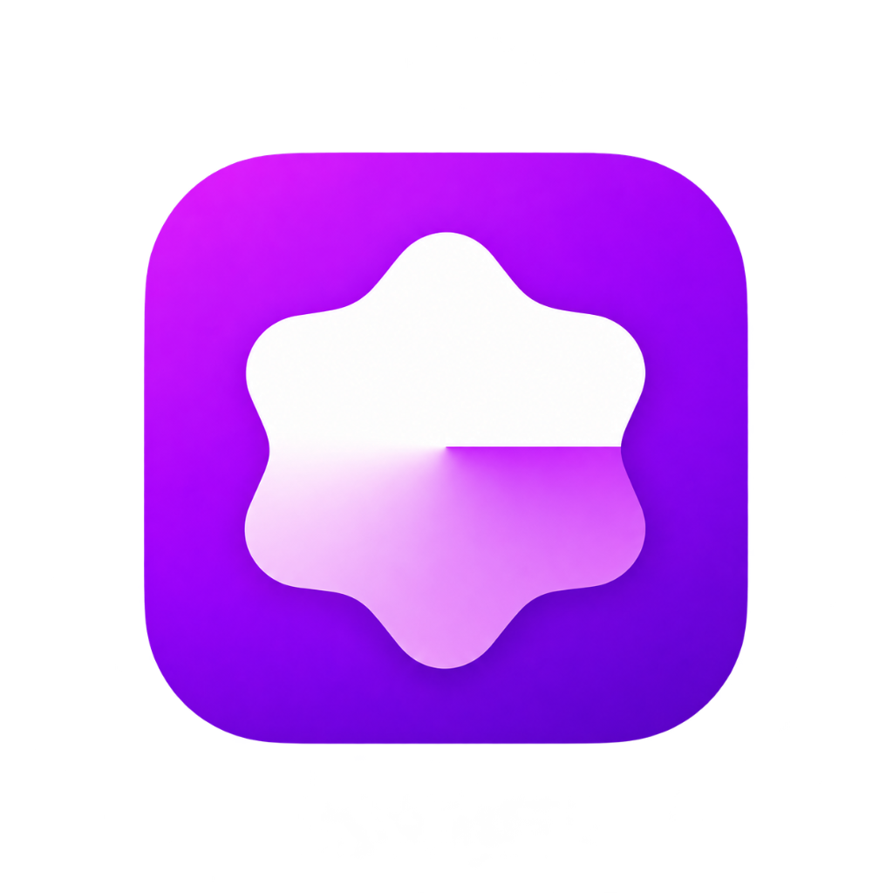

<div align="center">



# October

### Next-Generation Music Experience for Android

<br/>

[](https://android.com)
[](https://kotlinlang.org)
[](https://developer.android.com/jetpack/compose)
[](LICENSE)

<br/>

[**Overview**](#overview) · [**Features**](#features) · [**Design System**](#design-system) · [**Building from Source**](#building-from-source) · [**License**](#license)

</div>

---

## Overview

**October** is a beautifully crafted, privacy-first music client for Android engineered with **Kotlin** and **Jetpack Compose**. It features an elevated modern UI inspired by Apple Music and Spotify, low-latency audio playback via Media3/ExoPlayer, and a seamless listening experience without ads or bloatware.

---

## Features

<table>
  <tr>
    <td width="50%" valign="top">

### 🎵 Playback & Sound
- High-fidelity streaming powered by YouTube Music backend
- Low-latency background playback & cache for offline listening
- Audio normalization, gapless playback, and skip silence
- Advanced Equalizer with custom presets, pitch & tempo control
- Sleep timer with smooth fade-out

</td>
    <td width="50%" valign="top">

### 🎨 Refined Aesthetics
- **Squircle Modern Design**: 28dp elevated rounded bottom sheets
- **Active Queue**: Circular artwork with play overlays, "NOW" tracking, and reordering
- **Adaptive Ambient Engine**: Dynamic palette extraction from album art
- **True Black & Dark Modes**: Optimized for OLED displays

</td>
  </tr>
  <tr>
    <td width="50%" valign="top">

### 🎤 Synchronized Lyrics
- Synced real-time word/line lyrics with auto-scroll
- Multi-provider fallback engine (LRCLIB, BetterLyrics)
- Integrated lyrics translation & synchronized vocal tracking

</td>
    <td width="50%" valign="top">

### 📂 Library & Discovery
- Local and cloud-synchronized playlists
- Intelligent search with real-time predictions
- Safe YouTube Music library import and integration
- Quick picks tailored to your listening habits

</td>
  </tr>
</table>

---

## Design System

October adheres to a modern, expressive design philosophy:

- **Surface Tokens**: Deep space `#0E0E0E` / `#121214` obsidian backgrounds
- **Accent**: Electric Purple gradient (`#8A2BE2` → `#B026FF`) with glassmorphism touches
- **Sheet Architecture**: 28dp elevated bottom sheets with centered pill drag handles
- **Typography**: Clean, geometric hierarchy prioritizing scannability and legibility

---

## Building from Source

### Prerequisites
- Android Studio Ladybug (2024.2+) or newer
- JDK 17 or JDK 21
- Android SDK 35 (Android 15)

### Build Steps
```bash
# Clone the repository
git clone https://github.com/szzsuke/October.git
cd October

# Build the Debug APK
./gradlew assembleDebug

# Build the Release APK
./gradlew assembleRelease
```
The compiled APK will be generated at `app/build/outputs/apk/`.

---

## License

October is licensed under the [GNU General Public License v3.0](LICENSE).
